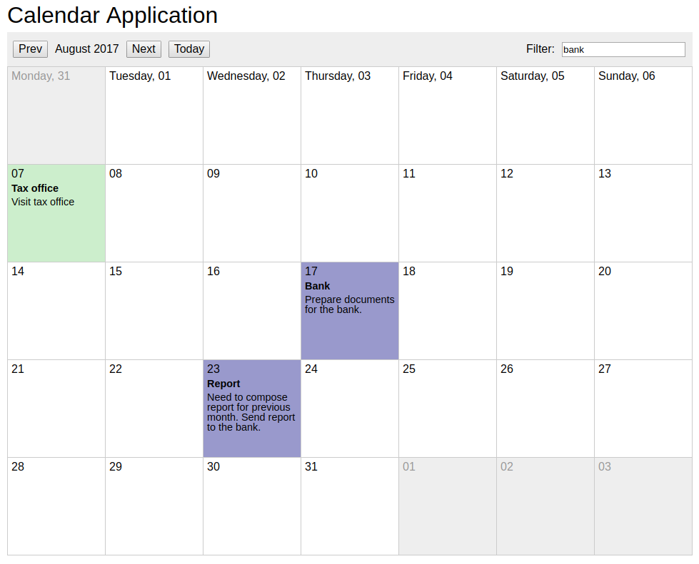

# Calendar

This is Calendar application.
Implemented by webpack, angular2, typescript, stylus, pug, moment.js.
It uses localStorge for saving events.

## install

`npm i`

## build

`npm run build`

## start development server

`npm run start`
